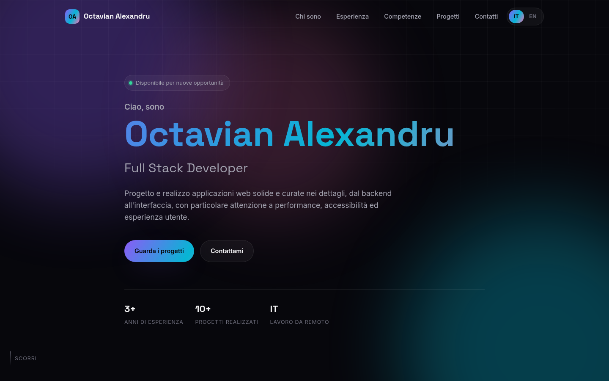

# Portfolio — Octavian Alexandru

Personal portfolio and resume landing page, built as a static site — no build step, no framework, no server required.



**Live preview:** _add the production URL here once deployed_

## Stack

Plain HTML5, CSS3 and vanilla JavaScript (ES5-compatible, no transpiler needed). No dependencies, no `node_modules` at runtime — the whole site is a handful of static files that any web host can serve as-is.

- Self-hosted variable fonts ([Inter](https://fonts.google.com/specimen/Inter) and [Space Grotesk](https://fonts.google.com/specimen/Space+Grotesk), latin subset only) — no third-party requests at runtime.
- Italian / English content switch, implemented with a small translation table and `data-i18n` attributes (see [Content & translations](#content--translations)).
- Scroll-based reveal animations and an animated gradient background, both disabled automatically when the visitor's OS requests reduced motion.

## Project structure

```
.
├── index.html              Single-page site (all sections)
├── 404.html                 Custom not-found page
├── robots.txt
├── assets/
│   ├── css/style.css        Design system + layout (custom properties, no preprocessor)
│   ├── js/
│   │   ├── main.js          Navigation, scroll reveal, language switch
│   │   └── i18n.js          English strings, keyed to the data-i18n attributes in index.html
│   ├── fonts/                Self-hosted woff2 fonts
│   └── img/                 Favicon and images
└── package.json             Optional local dev server script
```

## Local development

No installation required. Any static file server works; for convenience:

```bash
npm run dev
```

This starts a local server on `http://localhost:5500` via `npx serve` (nothing is installed globally or added to the repo).

Opening `index.html` directly in a browser also works, since the site has no build step.

## Content & translations

Italian is the source language and lives directly in `index.html`. Every translatable element carries a `data-i18n="section.key"` attribute; the English copy for that same key lives in `assets/js/i18n.js`. To update content:

- **Italian text:** edit it directly in `index.html`.
- **English text:** update the matching key in `assets/js/i18n.js`.
- **New translatable element:** add `data-i18n="your.key"` in the HTML and the English value in the dictionary — the switch logic in `main.js` picks it up automatically.

## Deployment (FTP — Tophost)

The site is a static bundle, so deployment is a plain file upload:

1. Connect to the Tophost space with an FTP client (e.g. FileZilla) using the credentials from the Tophost control panel.
2. Upload the contents of this repository into the site's web root (usually `public_html/` or `httpdocs/`), **keeping the folder structure** (`assets/` must stay alongside `index.html`).
3. Make sure `index.html` ends up directly in the web root, not inside a subfolder, so it's served at the domain root.
4. Once uploaded, the site works with no further configuration — there's no database and no server-side code to set up.

To publish an update: change the files locally, verify them (`npm run dev`), then re-upload only the files that changed.

## Browser support

Modern evergreen browsers (Chrome, Firefox, Safari, Edge). The layout degrades gracefully without JavaScript: content stays in Italian and fully readable, only the language switch and scroll animations are unavailable.
